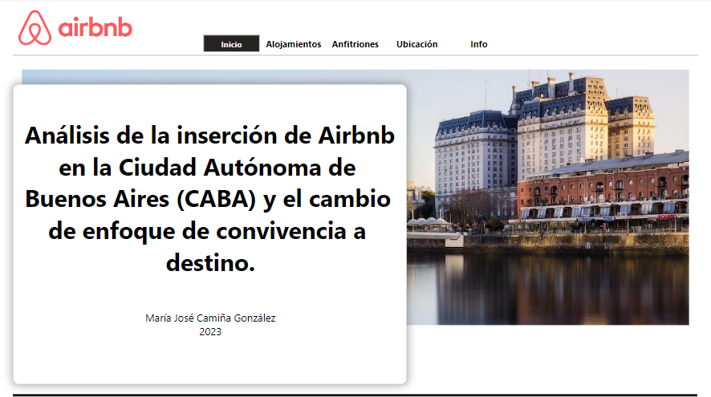
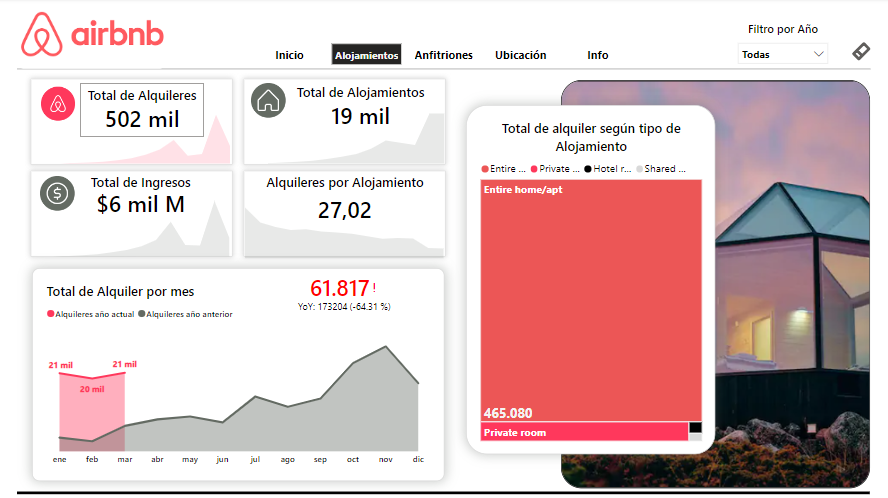
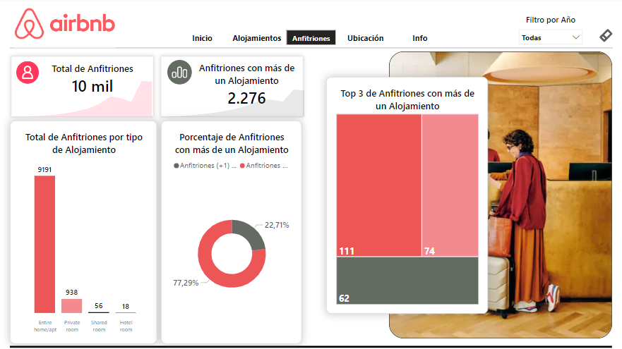
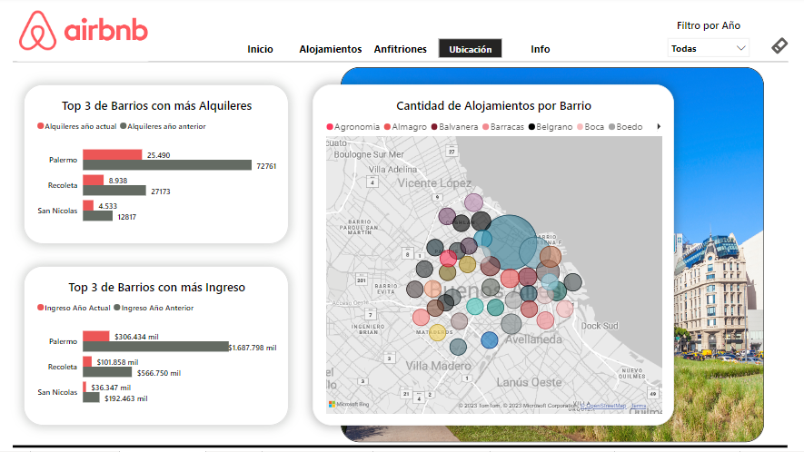
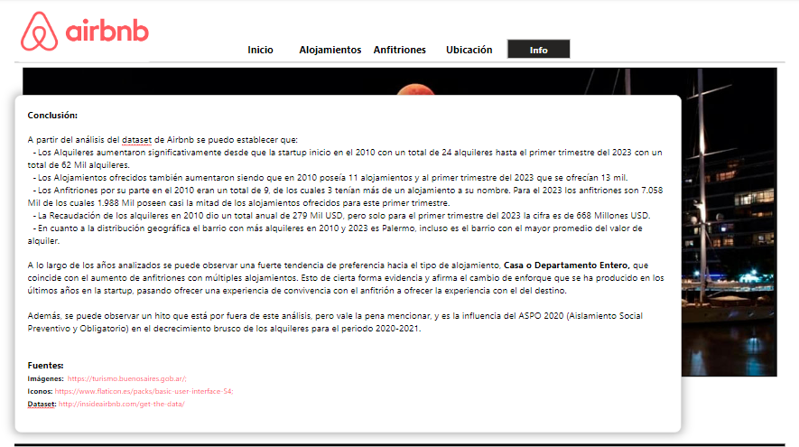

# Análisis de la inserción de Airbnb en la Ciudad Autónoma de Buenos Aires (CABA) y el cambio de enfoque de convivencia a destino con Power BI Desktop

## Introducción

Airbnb es una de las más recientes y exitosas startups de base tecnológica, que pertenece a la emergente industria de la hospitalidad, y opera bajo el modelo de "peer to peer" dentro de la economía colaborativa. Esto quiere decir que participa en una de las nuevas formas de mercado, el "comunitario", que se basa en la confianza entre el anfitrión y el huésped, quien busca una experiencia más enriquecedora que sólo alojarse en un hotel.

Airbnb surgió en 2008, cuando dos diseñadores que tenían espacio libre en su casa decidieron ponerlo a disposición de tres viajeros que buscaban un lugar para quedarse. Hoy, millones de anfitriones y huéspedes crearon su cuenta gratuita en la plataforma para disfrutar de una forma distinta de compartir con personas de todo el mundo.

Ofrece alojamientos únicos, experiencias, aventuras y mucho más, con la premisa de que a los anfitriones les va a encantar compartir sus espacios. También ofrece actividades en persona o en línea, organizadas por expertos de la zona y guías locales que llevan grupos reducidos a los territorios más inexplorados en expediciones 100 % inmersivas. 

Por otro lado, cuando se trata de viajes de negocios, "Airbnb for Work" tiene todo lo necesario para trabajar de forma remota.

Alguno de los servicios que ofrecen para la seguridad y protección son:
- Verificación de perfiles personales y anuncios.
- Mensajes inteligentes para que los anfitriones y los huéspedes se comuniquen con seguridad y confianza.
- Una plataforma confiable para cobrar y transferir pagos.
- El servicio de ayuda a la comunidad está disponible las 24 horas, los 7 días de la semana, en 11 idiomas distintos.

## Dashboard

### Portada



### Alojamientos



### Anfitriones



### Ubicación



### Info



## Objetivo

Analizar la inserción de Airbnb en la Ciudad Autónoma de Buenos Aires (CABA) y determinar a qué se debe el cambio de enfoque de convivencia a destino.

## Hipótesis

Con el paso de los años Airbnb ha crecido a gran escala, ampliando el mercado, incrementando su presencia en el mundo y también ha aumentado los conflictos con los lugareños y algunos gobiernos. Si bien parece ser la forma de alojamiento preferida de los últimos años para los jóvenes turistas, se han generado una serie de inconformidades y acusaciones. Entre los más significativos se encuentran la clandestinidad de los servicios, la falta de disponibilidad de alquileres permanentes para los residentes locales y la falta de regulación gubernamental.

Hoy en día Airbnb ya no pone el foco en la convivencia, sino en el destino. 

Entonces ¿Qué cambió?

1. ***La capacidad total:*** ¿Será que existe mucha oferta por parte de los anfitriones? Para esto se calculará: ¿Cuál es el total de alojamientos disponibles en CABA? ¿Cuál es el total de alquileres?
2. ***La cantidad y el tipo de alojamiento ofrecido por anfitrión:*** ¿Será que los anfitriones ya no viven en las propiedades que alquilan? Para determinar esto se calculará: ¿Cuántos anfitriones ofrecen alojamiento? ¿De qué tipo? y ¿Cuántos ofrecen múltiples alojamientos?
3. ***La concentración del mercado:*** ¿Será que los anfitriones dejaron de pertenecer a un mercado comunitario de economía colaborativa? Para esto se calculará: ¿Cuál es el valor promedio de la estadía por alojamiento? ¿Cuál es el porcentaje de distribución de los precios por tipo de alojamiento?
4. ***La distribución geográfica:*** ¿Será que los anfitriones ya no buscan ofrecer la experiencia de la convivencia si no el lugar? Para esto se calculará: ¿Cómo se distribuyen los alojamientos ofrecidos? ¿En qué barrio/comuna se concentran más? ¿Dónde se encuentran los alquileres de valores más altos?

Para poder desarrollar esta hipótesis correctamente se toman como fechas de reservas confirmadas las review de los usuarios.  

## Descripción de los datos

### Recolección

- ***Temática:*** Plataforma de alquileres temporarios internacional Airbnb

- ***Origen:*** Los datos fueron extraídos de [Inside Airbnb](http://insideairbnb.com/get-the-data/). Son datos trimestrales del último año, en este caso desde el 2010 hasta el primer trimestre de 2023, para la Ciudad Autónoma de Buenos Aires, Argentina. Estos datos están disponibles para su descarga gratuita en la página antes mencionada. Los mismos están sujetos a una Licencia Internacional Creative Commons Attribution.
- ***Composición de la fuente de datos***: El conjunto de datos consta de cuatro tablas principales:
  - **listings_detailed:** Datos de los alojamientos
  - **calendar:** Proporciona detalles de las próximas reservas
  - **neighbourhoods:** Proporciona la ubicación geográfica y el nombre del barrio del alojamiento
  - **reviews_detailed:** Reseñas detalladas dadas por los huéspedes.

## Nivel de aplicación

Este análisis está destinado al nivel estratégico, con el objetivo de mostrar y visualizar los posibles cambios de los anfitriones y los huéspedes de Airbnb, mediante un informe completo y actualizado, que sirva para identificar rápidamente si existen o no tales cambios. De esta forma se espera proporcionar una herramienta que monitoree estos indicadores y detectar a tiempo posibles desviaciones con respecto a la estrategia de la compañía. 

## Tipo de análisis

- **Análisis descriptivo:** En la primer fase del análisis se recopilaron los datos, se organizaron, tabularon y describieron, para poder encontrar un patrón para describir la situación y visualizar la evolución a lo largo de los años.
- **Análisis de diagnóstico:** Por medio del desarrollo del dashboard se pudo determinar una tendencia que afirma el cambio en la forma de alojamiento en la startup y el cambio de su premisa.

## Herramientas

- **Diagrams.net:** Creación del diagrama ER.
- **Documentos de Google Workspace:** Alojamiento de los archivos y versiones.
- **Flaticon:** Edición de las imágenes.
- **Gimp:** Edición de imágenes e íconos.
- **Github:** Alojamiento de repositorio del proyecto.
- **Google:** Búsqueda de las fuentes, datos, imágenes, colores, bibliografía, etc.
- **Microsoft Excel:** Lectura, estructuración y limpieza.
- **Notepad++:** Limpieza de valores no reconocidos por Excel.
- **Power BI Desktop:** Creación de tablas, análisis y desarrollo del tablero

## Listado de tablas

- **Tabla listings:** Contiene información sobre los lugares en alquiler a través de la plataforma Airbnb.
- **Tabla neighbourhoods:** Contiene la lista de barrios de CABA.
- **Tabla calendar:** Contiene información sobre las ofertas de alquiler.
- **Tabla reviews:** Contiene información sobre las reseñas de los huéspedes.
- **Tabla room_type:** Contiene la lista de tipos de habitación.

## Tratamiento de los datos

### Limpieza

CSV: Para poder utilizar los archivos CSV de reviews y listings se quitaron los saltos de línea `<br/>` con el procesador de texto Notepad++.

### Transformación

Tabla listings:
- Eliminación de datos faltantes o incompletos:
  - Registros sin id y nombre: 13
  - Registros sin id: 5
  - Registros vacíos: 2
  - Eliminación de 7 columnas que no son de interés para este análisis

### Normalización

Creación de nueva tabla: room_type
Creación del Tablero en Power BI Desktop

## Formato

### Paleta de colores

```
#ff385c, 646b63, #d9d9d9, #ffffff, #000000, #ff0000, #25ff00
```

### Fuente

- **Títulos:** Segoe UI Semibold
- **Tarjetas y KPI:** Segoe UI Bold
- **Encabezado:** Segoe UI
- **General:** Segoe UI

### Imágenes

 - [Turismo BA](https://turismo.buenosaires.gob.ar/)

### Iconos

- [Flaticon](https://www.flaticon.es/packs/basic-user-interface-54)

## Medidas por gráfica y solapa

### Solapa alojamientos/alquileres:

**Total de alquileres**
- Tipo de gráfica: Tarjeta 
- Medidas:
  ```
  Total de alquileres = COUNT('Tabla puente review-listing'[listing_id])
  ```

**Total de alojamiento**
- Tipo de gráfica: Tarjeta
- Medidas:
  ```
  Total de Alojamientos = DISTINCTCOUNT('Tabla puente review-listing'[listing_id])
  ```

**Promedio de precios de alquileres**
- Tipo de gráfica: Tarjeta
- Medidas:
  ```
    Promedio de precios = AVERAGE('Tabla puente review-listing'[price])
  ```
    
**Promedio de alquileres por alojamiento**
- Tipo de gráfica: Tarjeta
- Medidas:
  ```
  Promedio de alquileres por alojamiento = AVERAGE('Cantidad de alquileres por listing y host'[COUNT])
  ```
  
**Alquileres de años actual y anterior por mes**
- Tipo de gráfica: Áreas
- Medidas: 
  ```
    CY año actual = CALCULATE(MAX('Calendario Review'[Año]), ALLSELECTED())
  ```
  ```
    Año anterior: = [CY año actual]-1
    ```
  ```
  Alquileres año actual = var X = [CY año actual] RETURN CALCULATE([Total de alquileres], 'Calendario Review'[Año]=X)
  ```
  ```
  Alquileres año anterior = VAR X = [Año anterior] RETURN CALCULATE([Total de alquileres], 'Calendario Review'[Año]=X)
  ```
  ```
  Mes Corto = FORMAT('Calendario Review'[date],"Mmm")
  ```
  ```
  Total de alquileres = COUNT('Tabla puente review-listing'[listing_id])
  ```
        
**Total de alquileres según tipo de alojamiento**
- Tipo de gráfica: Treemap
- Medidas:
  ```
  Total de alquileres = COUNT('Tabla puente review-listing'[listing_id])
  ```
    
## Solapa anfitriones

**Total de anfitriones:**
- Tipo de gráfica: Tarjeta 
- Medidas:
  ```
  Total de anfitriones = DISTINCTCOUNT('Tabla puente review-listing'[host_id])
  ```
  
**Anfitriones con más de un alojamiento:**
- Tipo de gráfica: Tarjeta
- Medidas:
  ```
  Total de anfitriones con mas de un alojamiento = COUNTROWS(FILTER('Cantidad de listings por host', 'Cantidad de listings por host'[COUNT] > 1))
  ```
    
**Porcentaje de anfitriones con más de un alojamiento:**
- Tipo de gráfica: Tarjeta
- Medidas:
  ```
  Anfitriones con más de un Alojamiento = [Total de anfitriones con mas de un alojamiento]/[Total de anfitriones]*100
  ```
    
**Top Ten de anfitriones con más de un alojamiento:** 
- Tipo de gráfica: Treemap
- Medidas:
  ```
  Promedio de alquileres por alojamiento =  AVERAGE('Cantidad de alquileres por listing y host'[COUNT])
  ```
        
**Porcentaje de anfitriones con más de un alojamiento:**
- Tipo de gráfica: Anillos
- Medidas: 
  ```
  Anfitriones con un solo Alojamiento = 100 - [Anfitriones con más de un Alojamiento]
  ```
  ```
  Anfitriones con más de un Alojamiento = [Total de anfitriones con más de un alojamiento]/[Total de anfitriones]*100
  ```
    
**Total de anfitriones por tipo de alojamiento:**
- Tipo de gráfica: Columnas agrupadas
- Medidas: 
  ```
  Total de anfitriones = DISTINCTCOUNT('Tabla puente review-listing'[host_id])
  ```
       
## Solapa ubicación

**Top ten de barrios con más alquileres:**
- Tipo de gráfica: Barras agrupadas
- Medidas:
  ```
  Alojamientos LY = CALCULATE([Total de alquileres], SAMEPERIODLASTYEAR('Calendario Review'[date]))
  ```
      
**Top ten de barrios con mayor promedio de valor de alquiler:**
- Tipo de gráfica: Columnas agrupadas
- Medidas:
  ```
  Precio LY = CALCULATE([Promedio de precios], SAMEPERIODLASTYEAR('Calendario Review'[date]))
  ```
      
**Cantidad de alojamientos por barrio:**
- Tipo de gráfica: Mapa

## Conclusión

  A partir del análisis del dataset de Airbnb se puede establecer que:
  
  -	Los Alquileres aumentaron significativamente desde que la startup inició en 2010 con un total de 24 alquileres, hasta el primer trimestre del 2023 con un total de 62 mil alquileres. 
  -	Los Alojamientos ofrecidos también aumentaron siendo que en 2010 poseía 11 alojamientos y al primer trimestre del 2023 que se ofrecían 13 mil.
  -	Los Anfitriones por su parte en 2010 eran un total de 9, de los cuales 3 tenían más de un alojamiento a su nombre. Para el 2023 los anfitriones son 7.058 mil de los cuales 1.988 mil poseen casi la mitad de los alojamientos ofrecidos para este primer trimestre. 
  -	La Recaudación de los alquileres en 2010 dio un total anual de 279 mil USD, pero sólo para el primer trimestre del 2023 la cifra es de 668 millones USD.
  -	En cuanto a la distribución geográfica el barrio con más alquileres en 2010 y 2023 es Palermo, incluso es el barrio con el mayor promedio del valor de alquiler.  
      
A lo largo de los años analizados se puede observar una fuerte tendencia hacia el tipo de alojamiento **Casa o Departamento Entero**, que coincide con el aumento de anfitriones con múltiples alojamientos. Esto de cierta forma evidencia y afirma el cambio de enfoque que se ha producido en los últimos años en la startup, pasando de ofrecer una experiencia de convivencia con el anfitrión a ofrecer la experiencia con el destino. 

Además, se puede observar un hito que está por fuera de este análisis, pero vale la pena mencionar, y es la influencia del ASPO 2020 (Aislamiento Social Preventivo y Obligatorio) en el decrecimiento brusco de los alquileres para el período 2020-2021.

## Futuras Líneas
Análisis que se podrían incluir en el futuro:
- Analizar la relación entre las características de los alojamientos y las preferencias de los huéspedes. 
- Conocer las necesidades de los huéspedes. 
- Estudiar el posible impacto de Airbnb en la oferta de alquiler permanente para los ciudadanos de CABA.

## Versiones

- 1.0: 15/05/2023
- 2.0: 31/05/2023
- 3.0: 10/07/2023
- 3.1: 15/07/2023
- 4.0: 24/07/2023

## Referencias

*Sánchez, A.R. (2016). Economía colaborativa: un nuevo mercado para la economía social.* Revista de Economía Pública, Social y Cooperativa, 88, 231-258.
